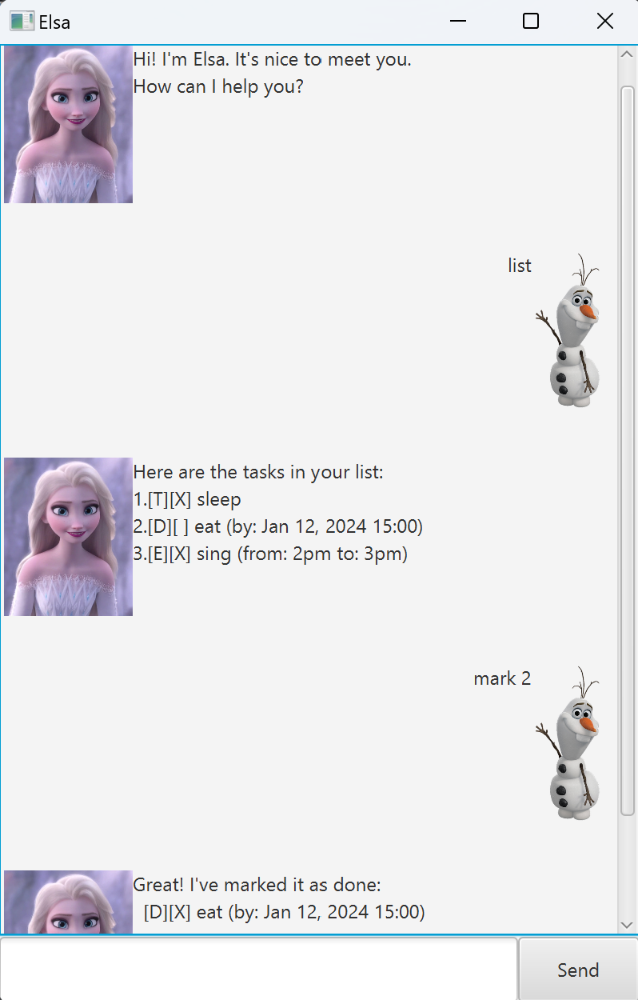

# Elsa User Guide



Elsa is your friendly task manager that helps you keep track of your tasks efficiently. With easy-to-use commands, 
you can add, mark, and find tasks, ensuring you stay organized and on top of your schedule.

## Adding ToDo Tasks

To add a ToDo task, you can use the `todo` command followed by the task description.

Examples: `todo eat`
  
Expected output:
```
Alright, I've added this task:
  [T][ ] eat
We have 1 task(s) in our list now.
```

## Adding Deadline Tasks

To add a Deadline task, you can use the `deadline` command followed by the task description and the due date/time.

Example: `deadline swim /by 2024-12-27 13:00`

Expected output:
```
Alright, I've added this task:
  [D][ ] swim (by: Dec 27, 2024 13:00)
We have 1 task(s) in our list now.
```

## Adding Event Tasks

To add an Event task, you can use the `event` command followed by the task description, the start time and the end time.

Example: `event go for concert! /from today 7pm /to 10pm`

Expected output:
```
Alright, I've added this task:
  [E][ ] go for concert! (from: today 7pm to: 10pm)
We have 1 task(s) in our list now.
```

## List Out All the Tasks

To list out all the tasks, you can use the `list` command.

Example: `list`

Expected output:
```
Here are the tasks in your list:
1.[T][] sleep
2.[D][] swim (by: Dec 27, 2024 13:00)
3.[E][] go for concert! (from: today 7pm to: 10pm)
```

## Delete Tasks

To delete a task from your list, you can use the `delete` command followed by the task number according to the list.

Example: `delete 1`

Expected output:
```
Okay, I've removed this task:
  [T][] sleep
We have 2 task(s) in our list now.
```

## Mark Tasks as Done

To mark a task as done, you can use the `mark` command followed by the task number according to the list.

Example: `mark 1`

Expected output:
```
Great! I've marked it as done:
  [D][X] swim (by: Dec 27, 2024 13:00)
```

## Unmark Tasks

To unmark a task, you can use the `unmark` command followed by the task number according to the list.

Example: `unmark 1`

Expected output:
```
Alright, I've unchecked this task:
  [D][] swim (by: Dec 27, 2024 13:00)
```

## Find Tasks

To find a task in the list, you can use the `find` command followed by the keyword you would like to search for. 
The keyword is case-insensitive.

Example: `find E`

Expected output:
```
Here are the matching tasks in your list:
1.[E][] go for concert! (from: today 7pm to: 10pm)
```
